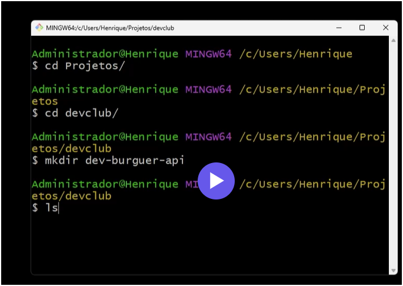
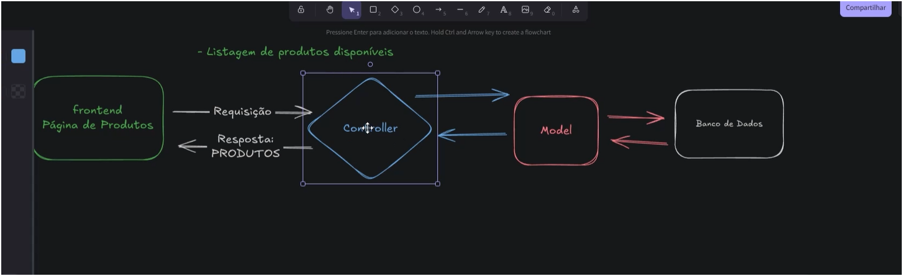
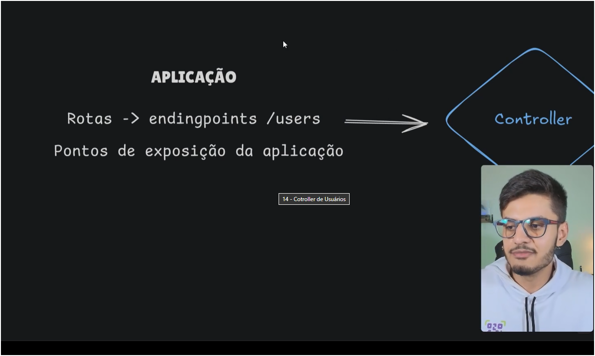

# DEV BURGUER API - DEV BURGUER BACK-END
Criação de back end do projeto de curso do Full Stack da Dev Club

# Gerar um projeto back end via terminal 

npm init -y -> gerar package.json

configurar sequelize para padronização e migrações do banco de dados

migrations sao processos para alterar dados do bd

configurando a primeira migração do async up para postar e down para se for necessario desfazer

alterando arquivos de banco de dados para cjs [database,migration] e no diretorio do sequelizerc 

arquitetura mvc

objetivando as seguintes informação -> 

métodos disponiveis da  arquitetura mvc nao podem ser duplicados, se necessário, crie outro controller

<!-->
store -> cria dado 
index -> lita todos os dados 
show -> listar um dado 
update -> atualiza dados
delete -> remover dados

<-->

 
preciso levar o controller para minha rota

manusear a rota com os métodos http 
get
post
put/patch
delete

Sempre buscar o método com base no conhecimento atual e no modo mais facil e rapido para resolver esse problema, inventar muita moda pode gerar mais problema e não é pra isso que sou programador.

desenvolvi, testo e corrijo, posto. 

quando estamos desenvolvendo um back end e precisamos testar se a migração/ comunicação e seu controller está rodando, pode-se usar uma aplicação chamada insomnia

cuidado com o module, quando arruma alguma coisa, precisa arrumar varias que englobam esse objeto
cuidado com password_hash, pode gerar falha de segurança 